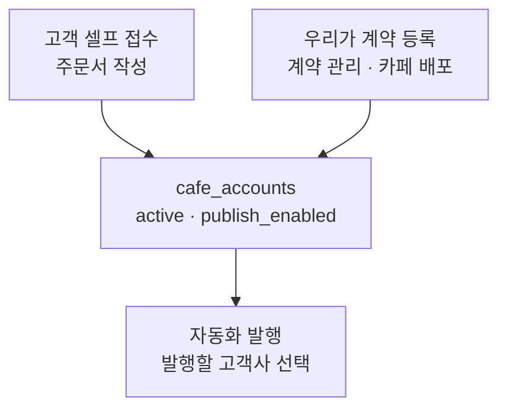
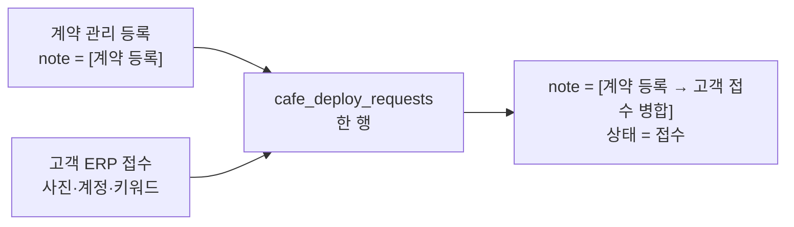

# 카페 배포 — 계약 등록에서 5위 24시간(+1)까지

계약 관리에서 카페 배포를 등록하면, 그 순간 자동화 발행·게시판 크롤·순위 추적·실적 반영이 전부 연결된다.
접수(주문서)로 들어온 업체는 접수 승인 시점에 같은 배선이 걸린다. 두 입구가 같은 파이프로 합쳐진다.

> **정문은 고객 ERP 접수다.** 계약 관리에서 직접 등록하는 경로는 그때까지 쓰는 임시 수단이고
> (사장님 확정 2026-08-21), 나중에 그 업체가 고객 ERP에서 접수하면 **같은 행에 자동으로 합쳐진다**.
> 아래 「두 경로가 만나면」 참고.

## 두 개의 입구

`계약 관리 → + 계약 추가 → 카페 → 카페 배포` 를 고르면 **카페 게시판 주소** 칸이 뜬다.
이 주소 하나가 아래 파이프 전체의 시작점이다. 비우면 계약만 잡히고 글이 추적되지 않는다.

## 계약 등록이 실제로 하는 일

계약 행(`client_contracts`)을 만든 뒤, 카페 배포일 때만 다섯 가지를 더 한다.
순서가 중요하다 — 앞이 비면 뒤가 헛돈다.

| 순서 | 무엇을 | 어디에 | 없으면 |
|---|---|---|---|
| ① | 게시판 주소·이름 | `cafe_studio_settings.board_url` | 게시판 크롤이 대상을 못 찾음 → **글이 영영 안 잡힘** |
| ② | 계정 생성 + 발행 승인 | `cafe_accounts.active` / `publish_enabled` | '발행할 고객사 선택' 목록에서 빠짐 |
| ③ | 목표 건수·금액·계약일·club_id | `cafe_accounts` | 관리시트가 빈 채로 남고, 순위를 남의 카페에서 잼 |
| ④ | 토큰 = 계약 건수 | `cafe_tokens` | 목록에 떠도 발행이 안 나감 |
| ⑤ | 이전 달성분 기준선 이월 | `cafe_rank_posts.top5_seeded` | 새 계약 진행률이 옛 실적부터 시작 |
| ⑥ | 관리자 카페 접수 목록에 등록(세팅중) | `cafe_deploy_requests` | 접수 목록에 안 떠서 **'발행하러 가기'를 누를 수 없음** |

⑥은 업체당 한 행만 유지한다(있으면 갱신). 계약을 여러 번 등록할 때마다 행을 새로 만들면
카페 대시보드가 `total_count` 를 겹쳐 세서 목표 건수가 부풀려진다.
상태를 바로 `세팅중`으로 두는 이유는 두 가지다 — 계약 등록 시점에 발행 승인·토큰이 이미 들어갔고,
'발행하러 가기' 버튼은 세팅중에서만 보인다. 목록에서는 파란 `계약 등록` 칩으로 고객 접수와 구분된다
(사진·네이버 계정·키워드가 비어 있는 것이 정상이다).

④는 **더하기가 아니라 맞추기**다. 같은 계약을 두 번 등록해도 잔액이 계약 건수와 같아진다.

재계약(`재계약` 버튼)도 똑같은 ①~⑤를 돈다. 신규 등록에만 없던 것을 2026-08-21 에 맞췄다.

## 등록 이후 — 매일 자동으로 도는 것

```mermaid
flowchart LR
    S["cafe_studio_settings<br/>board_url"] --> BC["cafe_board_crawl<br/>30분마다"]
    BC -->|"새 글 등록"| P["cafe_rank_posts<br/>excluded=false"]
    P --> RC["cafe_rank_crawler<br/>매일 01:00 전체크롤"]
    RC -->|"통합탭 순위"| M["measurements"]
    M --> T5["cafe_top5_tracker<br/>5위 24시간 유지"]
    T5 -->|"top5_achieved_at"| CS["cafe_contract_sync"]
    CS -->|"remain_count −1"| CT["client_contracts<br/>계약 진행률"]
```

- **게시판 크롤** (`cafe_board_crawl.py`, 30분) — `board_url` 에서 clubid·menuid 를 뽑아 글목록을 읽고,
  없는 글을 `cafe_rank_posts` 에 등록한다. 계정 연결은 `client_id → cafe_accounts.id`.
- **순위 측정** (`cafe_rank_crawler.py`, 매일 01:00 전체크롤의 뒷 구간) — `excluded=false` ∩ 계정 `active=true` 인 글 전부.
- **5위 24시간** (`cafe_top5_tracker.py`) — 인기글 테마섹션 5위 안을 24시간 유지하면 `top5_achieved_at` 을 찍는다.
- **계약 반영** (`cafe_contract_sync.py`) — 달성글 수 + `done_count` 로 계약 `remain_count` 를 깎는다.
  대행사 하부 업체의 달성은 `parent_client_id` 를 타고 **대행사 계약**으로 올라간다(`_attrib_map`).

## 두 경로가 만나면 — 자동 병합

계약 관리에서 잡아 둔 행은 **껍데기**다. 사진·네이버 계정·키워드가 없다 — 그건 고객 ERP 접수에만 있다.
그 업체가 나중에 고객 ERP에서 접수하면 **새 행을 만들지 않고 그 껍데기에 합친다**.

- **행을 나누지 않는 이유** — 같은 업체가 목록에 두 번 뜨고, 카페 대시보드가 세팅중·완료 행의
  `total_count` 를 전부 합산해 목표 건수가 두 배가 된다.
- **고객이 안 채운 칸은 계약 값을 남긴다** — `total_count`·`daily_count`·`mission_start`·`cafe_clubid`.
  (고객 접수 폼에는 clubid 칸이 아예 없다.)
- **상태는 `접수`로 돌린다** — 사진·계정이 방금 도착했으니 담당자가 다시 봐야 하고, 그래야 접수 알림도 뜬다.
  이미 `완료`인 건은 되돌리지 않는다.
- **칩이 바뀐다** — 파란 `계약 등록 · 고객 접수 대기` → 초록 `고객 접수 병합`.

껍데기 행은 **고객 화면에서는 감춘다**. 보이면 '세팅중'으로 읽혀 "우리는 접수 안 해도 되겠네"가 되고,
그러면 사진·계정이 영영 안 온다. 토큰 예약 계산에서도 뺀다 — 주문이 아니라 계약 그 자체라,
예약으로 세면 계약 건수만큼 잔액이 통째로 묶여 고객이 접수를 아예 못 넣는다(병합 경로가 막힌다).

## 계약이 끝나면

`(달성글 수) + done_count >= goal_count` 인 업체는 자동 정리한다 — `active=false`, `publish_enabled=false`,
그 계정의 글 `excluded=true`. 삭제가 아니라서 화면에는 계속 보이고, 매일 재측정만 멈춘다.

정리한 업체의 게시판은 크롤도 멈춘다. 고정 대상(`TARGETS`)에만 걸려 있던 이 차단을
2026-08-21 에 모델B(고객 자기 카페)에도 넣었다 — 그전에는 정리한 업체가 새 글을 쓰면
`excluded=false` 로 되살아나 매일 측정 대상으로 다시 들어왔다.

## 자주 막히는 곳

- **게시판 주소에 menuid 가 없다** (`.../articles/write` 로 끝나는 주소) → 카페 첫 게시판으로 자동 보정하지만,
  게시판이 여러 개면 엉뚱한 곳을 본다. `.../cafes/<club>/menus/<menu>` 형태로 넣는 것이 안전하다.
- **키워드 풀 0개** → 토큰이 있어도 발행 예정 큐가 비어 아무것도 안 나간다. 자동화 발행 탭에서 채운다.
- **`club_id` 가 비어 있다** → 기본값이 마이클 공유카페(ddmkt2)라 남의 카페로 박힌다. ③에서 주소로 채운다.
